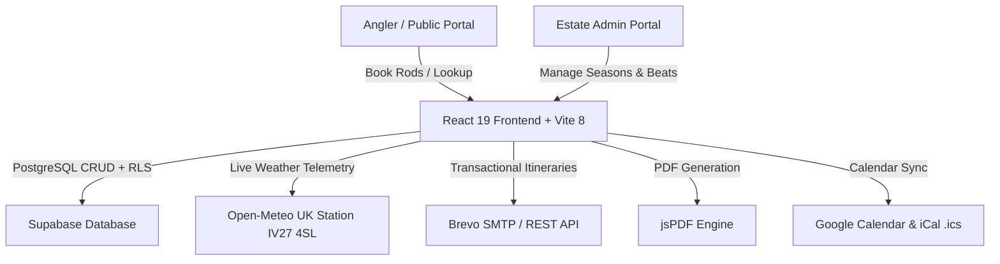

# 🎣 Scottish Highland Fishery Booking System

An enterprise-grade, full-stack angling reservation and estate management platform built with **React 19 + Vite 8 + Tailwind CSS + Supabase (PostgreSQL with RLS) + Brevo Transactional Email**.

Designed specifically for Scottish Highland river beats and loch fisheries (Postcode **IV27 4SL**, Sutherland, Scotland), featuring automatic daily rotation, real-time river gauges, interactive vector mapping, and instant angler itinerary dispatches.

---

## 🌟 Key Highlights & Features

### 🗺️ 1. Interactive River Map & Beat Selector
- **Interactive River Geography**: Visual representation of **Beats 1, 2, 3, 4, 5, and the Loch**.
- **Angler Pool Insights**: Real-time pool characteristics, water depths, wading safety guidelines, and target fish species (*Atlantic Salmon, Wild Brown Trout, Sea Trout*).
- **1-Click Beat Selection**: Direct integration between the river map and the reservation wizard.

### 🌤️ 2. Real-Time Meteorological & River Gauge (`IV27 4SL`)
- **Live Station Telemetry**: Automated live weather and precipitation data from Open-Meteo for postcode **IV27 4SL** (*Sutherland, Scottish Highlands*).
- **Live River Level & Spate Gauge**: Calculates estimated river height (e.g. `0.85m Optimal`) based on recent catchment rainfall.
- **Angler Sun Windows**: Precise sunrise and sunset timings for prime dawn & dusk bite windows.
- **Highland Fly Recommendations**: Dynamic fly recommendations (*Cascade #8, Sunray Shadow, Willie Gunn, Stoat's Tail*).

### ⚡ 3. Fair Cyclic Rotation & Concurrency Guard
- **Automatic Consecutive Rotation**: Consecutive multi-day bookings automatically rotate beats each morning, ensuring every guest experiences each beat without conflicts.
- **Concurrency & Double-Booking Guard**: Pre-commit validation and database Row-Level Security (RLS) policies prevent simultaneous slot collisions.
- **Sticky Trip Summary & Confetti**: Live pricing breakdown with celebratory confetti animation upon successful reservation.

### 📄 4. Digital Fishing Passes & Calendar Sync
- **High-Res PDF Permit (📥)**: 1-click downloadable Digital Angler Pass with booking references (`BK-xxxxx`), beat schedules, and conservation rules.
- **Calendar Integration**: 1-click **Add to Google Calendar** and downloadable **Apple / Outlook (`.ics`)** calendar files.
- **Export CSV**: Full roster and filter export for estate bailiffs and managers.

### 🔐 5. Security Hardening & Session Persistence
- **PostgreSQL Row Level Security (RLS)**: Strict access control ensuring public users cannot tamper with admin records.
- **Brevo API Sanitization**: Secure HTML entity escaping prevents script injection in transactional emails.
- **Admin Session Persistence**: Persistent authentication state across page reloads with quick demo credentials (`admin` / `admin`).
- **Flexible Search**: Instant lookup by Booking ID (`BK-00001` or raw `#1`), guest name, email, or phone.

---

## 🏗️ Architecture & Tech Stack



| Layer | Technology |
|---|---|
| **Frontend Framework** | React 19 + Vite 8 |
| **Styling & Aesthetics** | Nordic Clean Design System (Emerald `#059669` + Tailwind CSS) |
| **Icons** | Lucide React |
| **Database & Auth** | Supabase (PostgreSQL + RLS Policies) |
| **Email Service** | Brevo (Sendinblue) Transactional API + Node Proxy Fallback |
| **PDF Generation** | jsPDF Engine |
| **Live Telemetry** | Open-Meteo Free API (Postcode IV27 4SL, Lat: 58.4634, Lon: -4.8466) |

---

## 📁 Project Directory Structure

```
fishing-booking-system/
├── src/
│   ├── assets/               # High-res fishery imagery
│   ├── components/
│   │   ├── BookingForm.jsx   # Booking wizard with live trip summary
│   │   ├── Dashboard.jsx     # Bailiff operations dashboard & KPI metrics
│   │   ├── LoginForm.jsx     # Glassmorphic admin authentication
│   │   ├── RiverMap.jsx      # Interactive SVG river & beat map
│   │   ├── SessionSelector.jsx# Season switcher & creation drawer
│   │   ├── UserPortal.jsx    # Public angler landing portal & lookup
│   │   ├── ViewBookings.jsx  # All bookings with multi-filter & PDF/CSV export
│   │   ├── WeatherWidget.jsx # Real-time IV27 4SL weather & spate gauge
│   │   └── WeeklyView.jsx    # 6-day Mon-Sat roster schedule
│   ├── utils/
│   │   ├── calendarHelper.js # Google Calendar & .ics export helper
│   │   ├── dateHelpers.js    # Cyclic rotation and beat allocation algorithm
│   │   └── emailService.js   # Brevo API transactional email dispatcher
│   ├── App.jsx               # Application root, auth & view state
│   ├── App.css               # Nordic Clean tokens, glassmorphism & responsive styles
│   └── index.css             # Base fonts & Tailwind directives
├── database/
│   └── security_hardening_rls.sql # Supabase Row-Level Security migration
├── server/
│   └── proxy.js              # Optional Brevo Bearer authenticated proxy server
├── .env.example              # Environment variables template
└── package.json
```

---

## 🚀 Quick Start Guide

### 1. Clone & Install Dependencies
```bash
git clone https://github.com/OriyaHimanshu1198/fishing-booking-system.git
cd fishing-booking-system
npm install
```

### 2. Configure Environment Variables
Create a `.env` file in the root directory (refer to `.env.example`):

```env
# Supabase PostgreSQL Database
VITE_SUPABASE_URL=https://your-project.supabase.co
VITE_SUPABASE_KEY=your-supabase-anon-key

# Brevo (Sendinblue) Transactional Email
VITE_BREVO_API_KEY=xkeysib-your-brevo-api-key
VITE_BREVO_SENDER_EMAIL=your-verified-sender@example.com
VITE_BREVO_SENDER_NAME="River & Loch Fishery"
```

### 3. Database & RLS Setup
Execute the SQL script in [`database/security_hardening_rls.sql`](database/security_hardening_rls.sql) in your **Supabase SQL Editor** to create the tables and activate Row Level Security:

```sql
-- Creates 'sessions' and 'bookings' tables with conflict guards
-- Enables RLS policies for public booking submissions and admin operations
```

### 4. Run Development Server
```bash
npm run dev
```
Open **`http://localhost:3000/`** (or **`http://localhost:3001/`** if port 3000 is occupied).

### 5. Build for Production
```bash
npm run build
```

---

## 🎣 Booking Rules & Allocation Logic

1. **Operating Days**: Monday through Saturday (6 fishing days per week; Sunday reserved for conservation).
2. **Beat Capacity**: Exactly 1 angler rod per beat per day across 6 designated water stretches (Beats 1–5 + Loch).
3. **Fair Rotation Algorithm**: Consecutive 6-day guests automatically shift forward 1 beat each morning:
   $$\text{Beat}(d) = \text{BEATS}[(startBeatIndex + d) \bmod 6]$$
4. **Instant Confirmation**: Anglers receive an immediate HTML itinerary email + downloadable `.ics` calendar invite upon booking.

---

## 🔒 Security Best Practices Implemented

* ✅ **Input Sanitization**: HTML entity escaping (`_escapeHtml`) on all user-supplied names, emails, and notes.
* ✅ **Database Row-Level Security**: 4 active Supabase RLS policies enforce insert, update, and read boundaries.
* ✅ **Zero-Vulnerability Proxy**: Optional server proxy guarded by Bearer token authentication and strict CORS origins.

---

## 📄 License
This project is licensed under the **MIT License** — free to use and customize for private and commercial fisheries.
